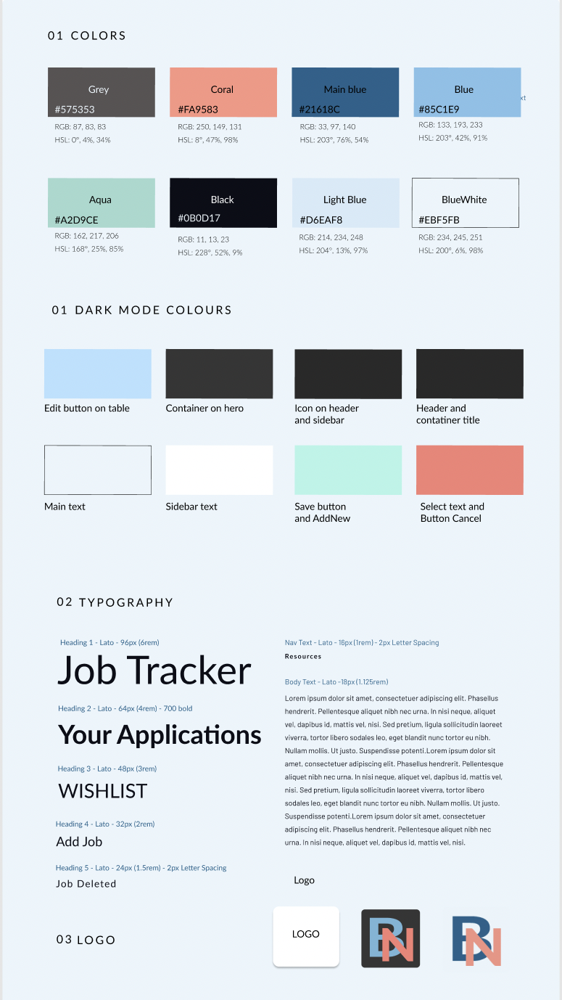
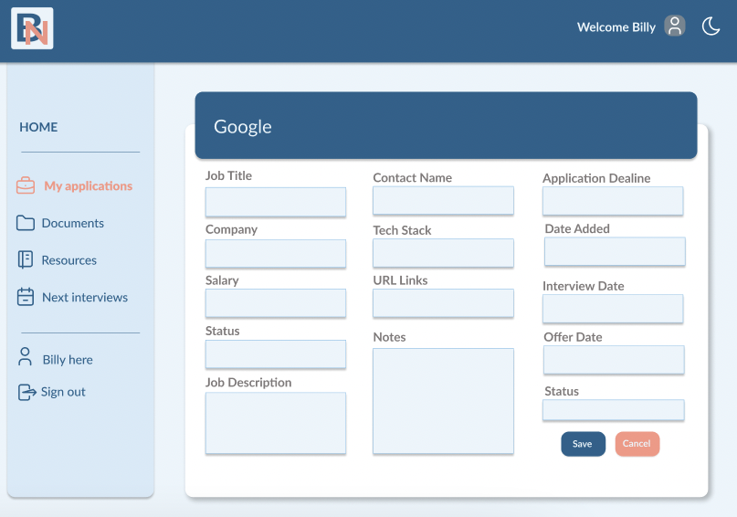
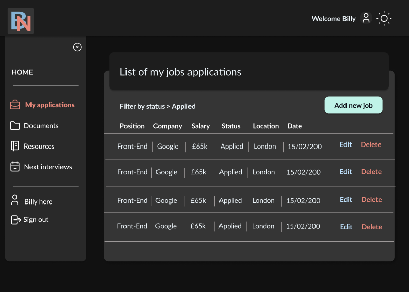

# Bossa Nova - Job Tracker

[Link to back-end repo](https://github.com/SchoolOfCode/final-project-api-bossa-nova)

[Link to live site](https://bossanova.netlify.app/)

Our team of 6 researched, designed and built this app from scratch in 4 weeks. We were all students at the [School of Code](https://www.schoolofcode.co.uk/).

We wanted to create a job tracker for tech workers that was better than using spreadsheets. Our app is more visually appealing, allows job filtering, has multiple fields and gives carefully selected resources for gaining a job in tech.

## Project Description

Our application enables the user to be authenticated via their Google account or email/password. They can add new jobs, edit and delete existing jobs, filter jobs by status and company and search for useful resources to get a tech role.

We used React because we wanted to learn more about this and get more practice with it. React is very flexible and allowed us to create many reusable components which reduced our development time. It’s also very fast and easy to test.

We decided to use Tailwind CSS instead of traditional CSS stylesheets because it offered a faster styling process and is a mobile-first, responsive framework. Tailwind took some time to learn, however it saved us time and altering styles near the end of the 4 week project.

We used auth0 for authentication and authorisation because it was easy to implement and reliable. We used React Router to enable us to make a one page app with nested routes that improved our app’s performance. React Alert was used to style alert messages on desktop and mobile connected to form validation. Finally, we utilised a table from MUI component library to have a stable, working table we could rely on.

### Challenges

- Styling with Tailwind because it was a new library that we hadn’t used before.
- Working with external libraries (lack of control). We had issues styling and adapting the MUI table we imported.
- React component tree - lack of structure caused issues and we had to revisit and create a more detailed component tree.

### Future Features

- In another week we could have completed an email notification feature that sends weekly summaries of your job applications.
- In another 2 weeks we would have added a data visualisation section with users application data displayed in charts and graphics
- Given an additional 3 weeks we believe we would have created a web scraper to allow users to search for, and apply to jobs from Indeed and LinkedIn.

## Table of Contents

- [How to Install and Run](#how-to-install-and-run)
- [How to Run Tests](#how-to-run-tests)
- [Front End Description](#front-end-description)
- [Wireframes and Designs](#wireframes-and-designs)
- [Our Process](#our-process)
- [Tech Stack](#tech-stack)
- [Authors info](#authors-info)

## How to Install and Run

Clone the repo down open the terminal in the root directory and install all dependencies by running

```
npm i
```

Once all dependencies are installed, run

```
npm run dev
```

This will open the project on localhost:3000.

If you want a fully working app you’ll have to create an environment variable called REACT_APP_API_URL and save this in a .env file in the root directory. This refers to a working database and will be connected to a fully functioning backend API.

```
REACT_APP_API_URL = mysupersecretapi
```

## How to Run Tests

We used Cypress to run end-to-end tests on our site. To run cypress tests execute this command:

```
npx cypress open
```

A new cypress window will open up with a list of all tests available, pick one and watch it run through all tests

We used React Testing Library for unit testing. To run React Testing Library execute this command:

```
npm run test
```

## Front End Description

- User authentication and authorisation - nobody else can access your job application data
- Add, delete and edit all your data
- Filter and organise your application data
- Access carefully curated resources to help you land a job in the tech sector
- Light/Dark mode
- Alert popups to enforce form validation requirements

## Wireframes and Designs







## Our Process

We used an Agile approach (1 week sprints, small manageable tickets, Jira board), and applied CI/CD principles.

We used a dev branch for development and a stable main branch for deployment. The Main and Dev branches are protected by enforced code reviews (you need 1 approval to merge into dev and 2 approvals to merge into main). Every new feature is developed by branching off the main branch and giving the branch a meaningful name and then making a pull requests to the dev branch again, once the dev branch is stable then it gets merged into the main branch as well.

We used pair-programming heavily throughout the whole project.

## Tech Stack

### Programming Languages


### Font End


### Design Tools


### Developer Tools


## Testing


## Hosting


## License

MIT

## Authors info

- Adriana Nobre Lawrence

  - [Portfolio](https://nobre-lawrence.vercel.app/projects)
  - [Github](https://github.com/drinobre)
  - [Linkedin](https://www.linkedin.com/in/adriana-nobre-lawrence/)
  <hr>

- Ben Holloway

  - [Linkedin](https://www.linkedin.com/in/ben-holloway-3388a6224/)
  - [Github](https://github.com/benmhcode)
  <hr>

- Chirag Mehta

  - [Linkedin](https://www.linkedin.com/in/chiragmehtauk/)
  - [Github](https://github.com/chirazzzz)
  - [Portfolio](https://chirag-designs-f2wb3.ondigitalocean.app/)
  <hr>

- Cintia Siqueira

  - [Portfolio](https://cisiq.dev)
  - [Github](https://github.com/ciisiq)
  - [Linkedin](https://www.linkedin.com/in/cintia-siqueira)
  <hr>

- Kattana Luz

  - [Portfolio](https://kattanaluz.github.io/portfolio1/)
  - [Github](https://github.com/kattanaluz)
  - [Linkedin](https://www.linkedin.com/in/kattana-luz/)
  <hr>

- Valerio Cipolla
  - [Portfolio](https://valeriocipolla.netlify.app/)
  - [GitHub](https://github.com/ValerioCipolla)
  - [LinkedIn](https://www.linkedin.com/in/valerio-cipolla-software-engineer/)
  <hr>
